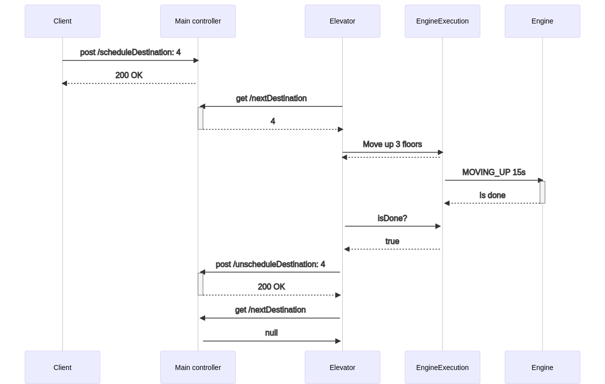

# Heissystem

Systemet er bygget med Spring Boot, og er delt inn i to moduler som kommuniserer via APIer:

* En heis som kan kontrollere en heismotor for å flytte en heisstol vertikalt mellom etasjer
* Et kontrollsystem som er ansvarlig for å oppdatere kjørekøen for heisen og ta imot forespørsler fra klienter som f.eks. knapper

All interaksjon med heissystemet skal gå via kontrollsystemet sitt API: kontrollsystemet er det eneste systemet som kommuniserer med heisen.

Systemet er satt opp for en bygning med 127 etasjer og en kjeller i 0. etasje. Det tar utgangspunkt i at heisen står i 1. etasje ved oppstart.

## Bygging og kjøring

For å bygge prosjektet, bruk kommandoen `./mvnw clean install`

Modulene kan deretter kjøres i to separate terminaler:

* Hovedkontroller: `java -jar elevator-main-controller/target/elevator-main-controller-0.0.1-SNAPSHOT.jar`
  * Hostes på http://localhost:8080/
  * Alle endepunkter er dokumentert på http://localhost:8080/swagger-ui/
* Heis: `java -jar elevator-entity/target/elevator-entity-0.0.1-SNAPSHOT.jar`
  * Hostes på http://localhost:8081/

Det er lagt til et endepunkt i hovedkontrolleren for å kunne kjapt køe opp noen etasjer for test
  * Dette er gjort ved å sende en GET-request til http://localhost:8080/populateSchedule

Så fort køen er fylt opp vil heisen starte å skrive ut aktiviteter og tilstandsoverganger i konsollen.
Disse endepunktene kan brukes for å kontrollere heisen og få tak i informasjon:

* http://localhost:8080/remainingTravelTime - gjenstående tid til neste etasje, i sekunder
* http://localhost:8080/currentDirection - skriver ut retningen heisen kjører i
* http://localhost:8080/stopElevator - (nød)stopp av heisen
* http://localhost:8080/resumeElevator - gjenopptar heisen aktiviteter fra der den ble stoppet

Begge modulene logger også til terminalen, så det er mulig å følge med derfra.

## Moduler

Oversikt over modulene som inngår i prosjektet.

### Domene (elevator-domain)

Inneholder felles domeneklasser som brukes for å kommunisere mellom modulene.

### Kontrollsystem (elevator-control-system)

Inneholder kontrollsystemet som styrer kjørekøen for heisen ved å legge til og fjerne destinasjoner.

Når tjenesten kjører er en oversikt over endepunktene tilgjengelig via swagger på http://localhost:8080/swagger-ui/ 

Viktigste endepunkter:

* POST `scheduleDestination`
* POST `unScheduleDestination`
* GET `stopElevator`
* GET `resumeElevator`

### Heis (elevator-entity)

Heisen har tre tilstander:

* `INACTIVE`: Heisen har ankommet en destinasjon og poller for ny destinasjon
* `IN_MOTION`: Heisen er på vei til en destinasjon
* `STOPPED`: Heisen har blitt stoppet

Mulige tilstandsoverganger:

Viktigste endepunkter:
* GET `stop` - Stopp heisen
* GET `resume` - Gjenoppta heisen
* GET `timeToDestination` - Returnerer informasjon om tid til neste destinasjon

#### Heismotor

Heisen styrer heismotoren (ElevatorEngine) direkte via en egen tråd.

Dette gjøres ved å instruere motoren med hvor lenge den skal kjøre, og i hvilken retning.
Motoren har derfor tre enkle tilstander:
* `MOVING_UP` - Motoren trekker oppover
* `MOVING_DOWN` - Motoren slipper heisen ned
* `STOPPED` - Motoren er stoppet/ingen bevegelse

### Sekvensdiagram

#### Vanlig brukssituasjon
Typisk sekvens der en klient (for eksempel en knapp) poster en forespørsel om at heisen skal til 4. etasje.

* I inaktiv tilstand poller heisen hovedkontrolleren etter ny destinasjon.
* Heisen holder på tråden som styrer heismotoren, og poller denne underveis i kjøringen for å se om den er ferdig. 
* Når motoren er ferdig, poller heisen hovedkontrolleren kontinuerlig for neste destinasjon 

#### Dataflyt ved forespørsel av kjøreretning

Ved forespørsel av kjøreretning blir forespørselen delegert frem til heisen. Ettersom heisen gjenspeiler motorens tilstand, vil den kunne returnere sin egen tilstand uten å måtte sjekke motoren. 

#### Dataflyt ved nødstopp av heis

Ved stopp av heisen blir forespørselen delegert til heisen, som avbryter heismotoren sin kjøretråd. Heisen vil da kun starte igjen med en `resume`-kommando. 

Heisen vil huske hvilken etasje den stod da den ble stoppet, og fortsette derfra ved gjenopptakelse.

